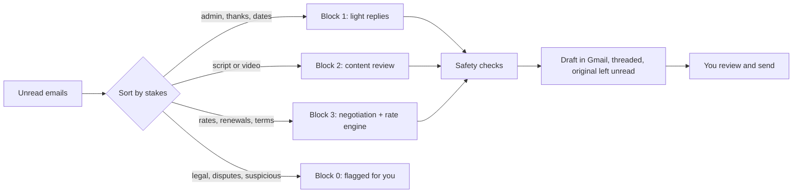

# Creator Management Inbox

**Your creator inbox, drafted in your voice.** Claude reads your unread partnership
emails, decides what an experienced influencer marketing manager would do, and
leaves a ready-to-send draft under each one in Gmail. Rate negotiations, script
feedback, go-live instructions, renewals, reschedules, declines. **It never sends
anything.** You glance, edit if you want, and hit send.

Built for people who run creator partnerships - brand-side partnership managers,
founders doing influencer marketing themselves, and anyone answering creators,
UGC makers and affiliates who is short on time.

> **Try it in about 15 minutes without connecting anything.** The demo answers six
> fictional creator emails (a rate counter, a script review, a renewal, a
> reschedule, an affiliate question and an email that tries to trick the AI), so
> you can judge the drafts before you give it access to anything. Sell physical
> products? Ask Claude to *switch to the e-commerce demo* for eight emails to a
> skincare brand: seeding, a late post, usage rights, an unpaid invoice, a payment scam.

---

## What you get

| | |
|---|---|
| **Inbox auto-draft** | Reads every unread email, sorts it (admin -> content -> money), drafts the reply you'd have written, threads it in Gmail, leaves the original unread, and gives you a one-page report |
| **Negotiation playbook** | Adapts to how your program runs - always-on or campaigns, per-creator fees or a budget pot, sales or reach or UGC - on top of a full rates-and-terms doctrine: the two-piece first deal, never a bare number, Voss-style calibrated questions, the re-scope counter, renewals, recalibrations, graceful exits |
| **Rate engine** | OPEN / TARGET / private MAX for every negotiation, from *your* rate bands - set up by interview or built from your past deals |
| **Your voice** | Reads your sent emails and interviews you for 5 minutes, then every draft sounds like you. House rules (no em dashes, words you never use) enforced automatically |
| **Content reviewer** | Reviews scripts and videos against a performance rubric and writes the feedback in your voice |
| **Creator notes** | One private note per creator: history, results, preferences, fees - so replies and renewals start from facts, not memory |
| **Safety built in** | Drafts only. Emails are treated as untrusted. A guard blocks send tools. Details in [SECURITY.md](SECURITY.md) |

It gets better the more you use it: each run compares its drafts with what you
actually sent and proposes rules from your edits. Target: 90%+ of drafts sent
without a single change.

## How it works (30 seconds)



Full walkthrough: [docs/HOW-IT-WORKS.md](docs/HOW-IT-WORKS.md).

---

## Get started

### What you need

- **Claude Code** - in the Claude desktop app (Code tab) or the terminal.
  [Install guide](https://code.claude.com/docs/en/setup).
- **A Mac, Linux, or Windows with WSL**, and Python 3.9+. A Mac has it, but the first
  use may ask to install Apple's free developer tools: click Install and wait a few
  minutes. Claude will help on other systems.
- **Gmail** (Google Workspace or personal). Outlook is planned for v1.1; Your Voice can
  already learn from an Outlook connector.
- About **15 minutes** for the demo, **30-45 minutes** for the full setup.

### Step 1 - Install (2 minutes)

In Claude Code, type these two commands:

```
/plugin marketplace add hakon-junge/creator-management-inbox-skills
```

```
/plugin install creator-management-inbox@creator-management-inbox-skills
```

Then **turn on updates** so you get improvements automatically: type `/plugin`,
open **Marketplaces**, select **creator-management-inbox-skills**, choose **Enable
auto-update**. Run `/reload-plugins` (or restart Claude Code).

### Step 2 - Hand it to Claude

Paste this into Claude Code:

```
Set up my Creator Management Inbox. Start with the demo so I can see the drafts, then
walk me through connecting Gmail, my profile, my voice and my rates, one step at
a time. I'm not very technical, so explain each step in plain words.
```

That's it. Claude runs the `inbox-setup` skill and guides you through:

| Stage | Time | What happens |
|---|---|---|
| 1. Demo | 15 min | Six fictional emails answered (eight in the e-commerce demo); open the drafts in your browser |
| 2. Connect Gmail | 15 min | Your own private Google connection ([guide](plugins/creator-management-inbox/skills/inbox-setup/references/connect-gmail.md)) |
| 3. Program + profile | 15-25 min | How your program runs (always-on or campaigns, budget, what success means, how you set fees), then your company facts from your website |
| 4. Your voice | 10 min | Built from your sent emails + a short interview |
| 5. Your rates | 10 min | From your past deals, or a guided interview |
| 6. First real run | 5 min | Drafts for your 5 newest unread emails, in Gmail |

### Step 3 - Use it

| Say | What happens |
|---|---|
| `run my inbox` | Drafts replies to every unread email, then reports |
| `run my inbox, only the 5 newest` | Same, limited |
| `reply to the email from Maya` | One thread |
| `what should I offer Maya? 41k views, US audience, she asked for $2,400` | A rate card and the recommended move |
| `review this script` + paste | Approve / request edits, feedback in your voice |
| `add Leo to my creator notes` | Creates his note from your email history |
| `build my voice` / `set up my rates` | Improve drafts / numbers any time |
| `is everything set up?` | Health check with the fix for anything missing |

---

## You are the sender

Every draft is a suggestion. You read it, you decide, you press send, and what you
send is yours: the numbers, the terms, the promises. Check every money email
before it goes out. The tool is provided as-is under the MIT licence, with no
warranty and no guarantee that a draft is correct.

## Support

Maintained by a small team, best effort. **Supported today:** Gmail on macOS, in
Claude Code. Linux and Windows (WSL) should work but are less tested; Outlook is
planned for v1.1. Bugs and setup problems go in [Issues](../../issues/new/choose),
questions in [Discussions](../../discussions). We read everything and prioritise
what affects the most people; we can't offer one-to-one setup help or response
times.

## Your data stays yours

Everything personal lives in **one private folder on your computer**,
`~/.claude/inbox/`, readable only by your user account. It is never inside the
plugin, so updates never touch it, and it's never uploaded anywhere by this tool.

```
~/.claude/inbox/
  profile/      your program, company facts, voice, rates, settings (plain text, edit freely)
  creators/     one note per creator
  attachments/  the only folder drafts may attach files from
  runs/         what was drafted, for learning (text auto-deleted after 14 days)
  token.json    your Gmail connection (never read by Claude directly)
```

**Please know:** to write a reply, Claude reads the email. That means email content
is processed by Anthropic's Claude models under your Claude account's terms.
If your company has an AI policy, check it first. See [SECURITY.md](SECURITY.md).

## Levels

- **Level 1 - Out of the box:** demo, Gmail, your program and profile. Good admin and
  content replies; money emails ask creators for their stats instead of naming fees.
- **Level 2 - Sounds like you:** your voice profile. The biggest single jump in
  draft quality.
- **Level 3 - Negotiates for you:** your rate bands and creator notes. Money emails
  name the right number with the right mechanism.
- **Level 4 - Your whole stack:** CRM and data sources, advanced rate engine on
  your own warehouse, house rules learned from your edits.

## Your Voice (a second plugin in this marketplace)

Want your voice in everything you write, not just creator emails? **Your Voice**
writes email, chat, LinkedIn posts and docs the way you would. It starts with a
strong default voice, learns yours from your sent writing when you say "build my
voice", and keeps it current with "refresh my voice". Your voice is one plain
`voice.md` in `~/.claude/voice/` that you can take to any AI tool.

```
/plugin install your-voice@creator-management-inbox-skills
```

Details: [plugins/your-voice/README.md](plugins/your-voice/README.md).

## FAQ

**Can it send emails by accident?** The tool has no send command, a guard blocks
mail connectors' send tools (and, during runs, every acting tool), and every draft
needs you to press send. Google has no
"drafts only" permission, so we'd rather tell you exactly how this is enforced
than promise more: [SECURITY.md](SECURITY.md).

**Does it work with Outlook?** Not yet - Gmail first. Outlook is planned for v1.1
(same skills, a second connector). Your Voice can already learn your style from an
Outlook connector. Watch the repo or open a Discussion.

**What does it cost?** The skills are free and MIT-licensed. You need a Claude plan
that includes Claude Code. Google Cloud for the Gmail connection is free.

**Will it work for my niche?** The playbook is niche-agnostic; your profile, rates
and voice make it yours. It's written from the brand/partnerships side of the table.

**How do I update it?** With auto-update on, nothing to do - you'll see "Plugin
updated, run /reload-plugins". Your profile is never touched by updates.

**How do I remove it?** Say "disconnect my Gmail", then `/plugin uninstall
creator-management-inbox@creator-management-inbox-skills`, then delete `~/.claude/inbox/` if you
want your profile gone too.

## Feedback and support

- **Something broken?** [Open an issue](../../issues/new/choose).
- **A draft that wasn't good enough?** Use the "Draft quality" issue template -
  fictional or redacted examples only, please. This is how the playbook improves
  for everyone.
- **Ideas and questions:** [Discussions](../../discussions).
- If this saves you time, a star helps other partnership people find it.

Maintained by Fluencrs: [Håkon Junge](https://github.com/hakon-junge) and
[Yuliia Maryniak](https://github.com/yuliiahq). See [CONTRIBUTING.md](CONTRIBUTING.md).
Licensed [MIT](LICENSE).
