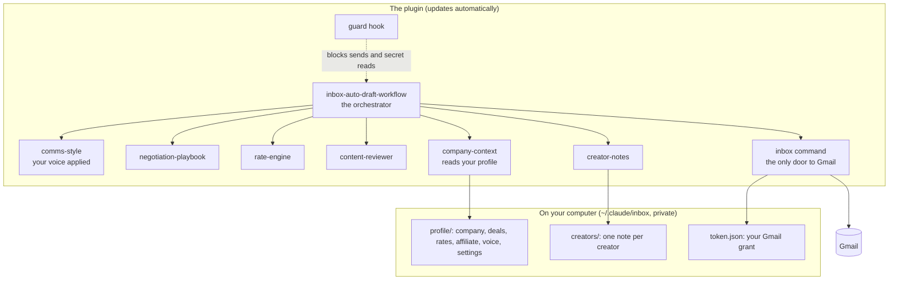
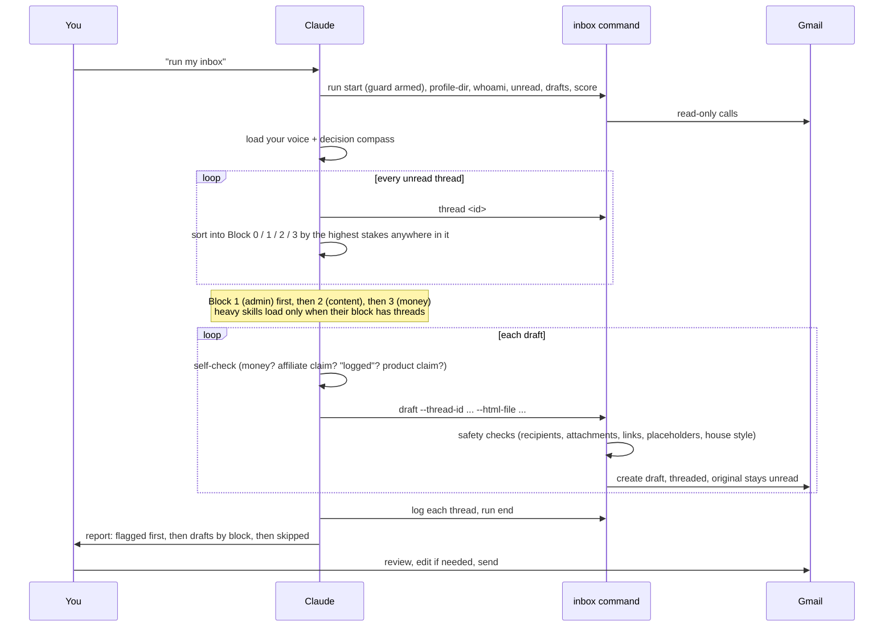
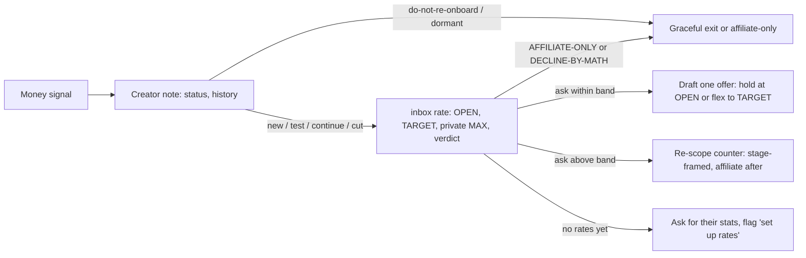

# How it works

This is the detailed tour: what happens when you say "run my inbox", which skill
does what, and why it's built this way.

## The pieces



- **Skills** are instructions Claude follows. They hold the method.
- **Your profile** holds the facts: your product, offer, terms, rates, voice.
  Skills never invent a fact; an empty field means "leave it out or ask".
- **The `inbox` command** is the only thing that touches Gmail. It reads mail,
  creates drafts, and runs the safety checks in code.
- **The guard hook** blocks sending and secret access around Claude.

## One run, step by step



### Why blocks?

Every thread is bracketed by its **highest-stakes** signal anywhere in its history -
"sounds good" at the bottom of a thread that discussed a rate is a money thread.
Then blocks are worked lightest first:

| Block | What | Loads |
|---|---|---|
| 0 | legal structure, disputes, PR, suspicious emails | nothing - flagged for you, a safe holding draft at most |
| 1 | admin, dates, thanks, forms, program questions | your voice + the matching reply shape + the one fact needed |
| 2 | scripts, videos, drafts to review | + content-reviewer + the feedback shape + your pack's review rubric (the go-live shape only to approve) |
| 3 | rates, counters, renewals, giveaways, rights | + negotiation-playbook core + the rate card guide + your pack; each module and playbook reference only when the thread triggers it |

Two reasons. Heavy strategy only loads where the stakes justify it. And a model
holding a negotiation playbook writes a stiffer "thanks, got it" - keeping doctrine
out of context while the light replies are written keeps them sounding human.

One creator with threads in two blocks is handled entirely in the higher block, so
a money decision can never contradict an admin reply you drafted a minute earlier.

### The autonomy ladder: draft, don't ask

A question in chat costs you a context switch and produces nothing. A draft you
edit costs ten seconds and produces a sent email. So when something is unclear:

1. Resolve it from the thread, the creator's note, the profile.
2. If the missing fact is the creator's (a date, their stats), **the draft asks them**.
3. Genuinely stuck: a safe draft that moves things forward without committing money
   or terms, flagged ⚠️.
4. Only true escalations (new contract structure, disputes, legal/PR, suspicious
   emails) get no committing draft.

## Your program shapes every money email

`program.md` holds your answers - what you sell (ecommerce, saas, b2b), how you run
it (always-on, campaigns, seasonal), how money is allocated (per creator, a monthly or
campaign pot, no cash), what success means (sales, signups, reach, content,
pipeline), how fees are set (views, rate card, their quote, commission, gifting),
what a deal looks like (test then scale, one-off, ambassador) and who you work with -
plus your own two-sentence pitch. Most answers can be a list.

`inbox program` turns them into a load plan using `program/manifest.json`: the
**pack** (your business type), the **modules** (program mechanics such as affiliate,
views pricing or usage rights, each with the answer that switched it on) and the
files each block loads, with line counts. An optional `modules: +x, -y` line
overrides. The `saas` and `ecommerce` packs are built; `b2b` runs the shared core plus
your modules.

Every money thread loads the pack next to the playbook's core, and each module when the
thread triggers it (its `when` in the manifest: the affiliate module for a renewal of a
creator on commission, views pricing when a fee is priced from views; a commission
program loads the affiliate module every time). Rules that must hold even when a module
isn't loaded live in the core. So the framing follows your program: a campaign program with a fixed pot never says "we
don't work with set budgets" or "we want to work together for years"; a UGC program
prices per asset and never talks about views; a commission program opens with the
affiliate offer. Anything left blank keeps drafts neutral rather than borrowing someone
else's model.

## The money path



The playbook's core rules: every number travels with its mechanism; creators move
the price, you move the deliverable; a first deal is two pieces, so each gets a fair
read; the affiliate never sits in our first number; MAX and break-even never reach a
creator.

## How it learns

After each run, `inbox score` compares every draft with what you actually sent on
that thread. Unedited sends count toward the zero-edit rate (target 90%+). Edits
become candidate rules: wording goes into your `voice.md`, decisions into
`house-rules.md`, facts into the right profile file. Nothing changes without your OK,
and the plugin's own files are never edited on your machine - improvements that
would help everyone come back through GitHub issues.

## Where to look in the repo

```
plugins/creator-management-inbox/
  program/                       manifest.json + business packs and program modules
  skills/
    inbox-auto-draft-workflow/   the orchestrator + compass + reply shapes
    comms-style/                 voice engine + a fictional example voice
    voice-builder/               builds your voice.md
    negotiation-playbook/        rates and terms strategy (+ deep references)
    rate-engine/                 the numbers (simple + advanced warehouse mode)
    content-reviewer/            script and video review
    creator-notes/               one note per creator
    company-context/             reads your profile; templates live here
    inbox-setup/                 guided setup + the Gmail guide
  scripts/inbox.py               the inbox command
  hooks/guard.py                 the send guard
  demo/                          fictional inboxes + profiles: Fernwell (saas, the default)
                                 and Quillmoss (`demo_profile: ecommerce` in settings.md)
```
